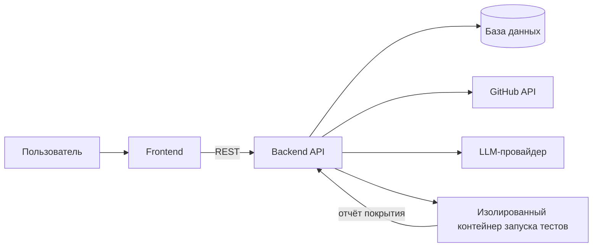

# Архитектура AI-Merge-Assistant

> Исторический черновик, сохранённый для контекста. Актуальная архитектура, обязанности участников, контракты и условия начала GitHub-этапа находятся в [договоре команды](team-guide.md). Ниже остались прежние предложения, включая OAuth App, BackgroundTasks и другие языки; они не являются текущими требованиями.

## 1. Цель и границы

Сервис принимает изменения в ветке (diff, коммиты, описание PR) или загруженные требования с кодом, генерирует по ним тесты, проверяет их запуском и покрытием и принимает решение о мерже.

**В рамках первой версии:** Python-проекты, pytest, GitHub. Один демо-репозиторий с предсказуемым поведением.
**Вне рамок:** GitLab, произвольные окружения и системы сборки, обучение собственных моделей.

## 2. Общая схема



Тяжёлые операции (генерация, запуск тестов) выполняются в фоне: API создаёт запись о прогоне, сразу возвращает его id, а фронтенд опрашивает статус.

## 3. Поток данных

1. Пользователь входит через GitHub OAuth, выбирает репозиторий, исходную и целевую ветку.
2. `github/` получает diff (compare API), сообщения коммитов и описание PR.
3. `parsing/` разбирает изменённые файлы на функции и классы (для Python через `ast`), чтобы передавать модели нужный контекст, а не файл целиком.
4. `llm/` по diff, коду и описанию PR строит сценарии Gherkin, затем конвертирует их в pytest-тесты.
5. `validation/` проверяет результат: корректность Gherkin, `ast.parse`, `pytest --collect-only`. Невалидное возвращается на перегенерацию.
6. `runner/` запускает тесты в контейнере, собирает отчёт coverage.py и считает покрытие нового кода через diff-cover.
7. Если покрытие ниже порога, `llm/` получает список непокрытых строк и ошибки падений и дописывает тесты (ограниченное число итераций).
8. При успехе `github/` отправляет тесты в ветку, выставляет статус и разрешает мерж (вручную или автоматически).
9. `export/` отдаёт `.feature`, `.py`, `.js` и zip-архив.

## 4. Модули backend

| Модуль | Ответственность | Владелец |
|---|---|---|
| `api/` | роутеры: auth, repos, runs, testcases, exports, stats | Артем З |
| `core/` | конфигурация из `.env`, безопасность, логирование | Артем З |
| `db/` | модели и сессия БД | Артем З |
| `schemas/` | pydantic-схемы, они же API-контракт | общий, правки через PR |
| `services/github/` | OAuth, клиент API, diff, пуш тестов, статусы, мерж | Вадим и Артем З |
| `services/parsing/` | документы → требования, разбор кода | Иван |
| `services/llm/` | обёртка над провайдером, промпты, Gherkin, автотесты, цикл по покрытию | Вадим |
| `services/runner/` | запуск тестов, coverage.py, diff-cover | Артем З и Макс |
| `services/validation/` | шлюз качества | Иван |
| `services/export/` | `.feature`, `.py`, `.js`, zip | Иван |

Каждый сервис скрывается за узким интерфейсом (функции или классы с чёткими входом и выходом), чтобы модули можно было разрабатывать параллельно и подменять заглушками.

## 5. Статусы прогона

```
queued → generating → validating → running → checking_coverage → ready
                                                    │
                                                    ├→ improving (цикл дозаписи) → running
                                                    └→ failed
```

Из этих статусов строится индикатор прогресса на фронтенде.

## 6. Черновик API

> Предварительный список, контракт фиксируется в `schemas/` и OpenAPI (`/docs` у FastAPI).

| Метод | Путь | Назначение |
|---|---|---|
| GET | `/auth/github/login` | старт OAuth |
| GET | `/auth/github/callback` | завершение OAuth |
| GET | `/repos` | репозитории пользователя |
| GET | `/repos/{owner}/{repo}/branches` | ветки репозитория |
| POST | `/runs` | создать прогон (репозиторий, ветки или загруженные файлы) |
| GET | `/runs/{id}` | статус и результат прогона |
| GET | `/runs/{id}/testcases` | сценарии и автотесты |
| GET | `/runs/{id}/coverage` | покрытие по файлам и строкам |
| POST | `/runs/{id}/merge` | выполнить мерж, если условия выполнены |
| POST | `/uploads` | загрузка требований и кода (ручной режим) |
| GET | `/runs/{id}/export` | выгрузка файлов (параметр формата) |
| GET | `/stats` | данные для дашборда |

## 7. Данные (черновик)

- **User:** id, github_id, имя, токен доступа (хранится зашифрованным).
- **Run:** id, пользователь, репозиторий, исходная и целевая ветки, статус, порог покрытия, итоговое покрытие, время.
- **TestCase:** id, run, текст Gherkin, код автотеста, статус (прошёл, упал, не запускался).
- **CoverageReport:** run, файл, покрытые и непокрытые строки, процент.

## 8. Безопасность

- Чужой код запускается только в одноразовом изолированном контейнере (без доступа к секретам бэкенда, с лимитами по времени и памяти, по возможности без сети).
- Секреты (`GITHUB_CLIENT_SECRET`, `LLM_API_KEY`) хранятся только в `.env`, который не коммитится. Если секрет попал в историю, его нужно перевыпустить.
- OAuth-токены пользователей не пишутся в логи.
- Автомерж выключен по умолчанию и включается явной настройкой.

## 9. Ключевые решения и компромиссы

| Решение | Причина |
|---|---|
| LLM по API, без обучения моделей | быстрее, лучше качество, нет затрат на инфраструктуру |
| Тонкая обёртка над LLM и настройка через `.env` | можно сменить провайдера без правок кода |
| Покрытие считается по новому коду (diff-cover) | соответствует цели «покрыть изменения», а не весь проект |
| Фоновые задачи через `BackgroundTasks` | достаточно для хакатона, без отдельной очереди |
| Только Python и pytest в первой версии | предсказуемое окружение и стабильное демо |
| Контекст для LLM: diff + код функций + описание PR | сообщения коммитов описывают намерение, но не изменения |

## 10. Риски

- Тесты, сгенерированные по коду, могут закрепить его баги. Смягчение: подавать описание PR и требования как источник ожидаемого поведения.
- Покрытие 90–100% достигается не всегда. Смягчение: настраиваемый порог, итерации дозаписи, вывод непокрытых строк.
- Окружение чужого репозитория может не собраться. Смягчение: демо-репозиторий, позже запуск через GitHub Actions.
- Медленные ответы LLM на демонстрации. Смягчение: заранее подготовленный прогон и кэш результатов.

## 11. План (по слоям)

1. **Ядро:** вертикальный срез «требование или diff → Gherkin → pytest → запуск → покрытие → экран».
2. **Остальное по критериям:** экспорт, дашборд, подсветка покрытия, docker-compose, CI/CD.
3. **GitHub-интеграция:** OAuth, выбор веток, diff, пуш тестов, статус PR.
4. **Цикл дозаписи тестов** по непокрытым строкам.
5. **Автомерж** и полировка демо.
